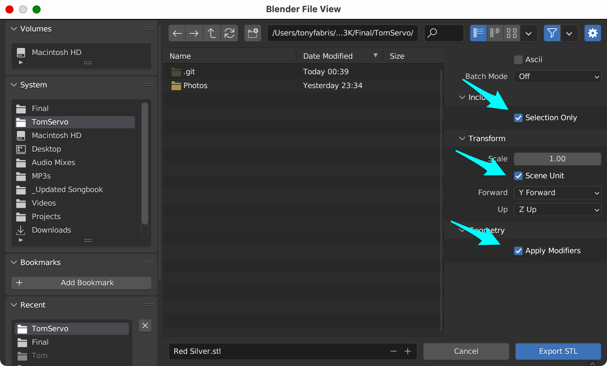
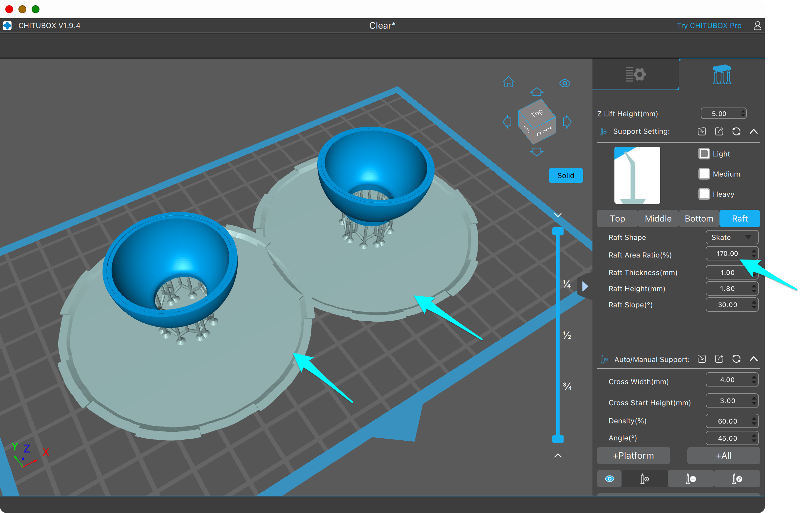

Tom Servo - Resin Print Model
=============================
&copy; 2024 by Tony Fabris

https://github.com/tfabris/TomServo

|  |  |  |
| ---------------------------------------------|----------------------------------------------|----------------------------------------------|

A project for resin-printing a small model of a character from Mystery Science Theater 3000. Not intended for making a full size puppet. Final size of model is approximately 13cm (5⅛ inches) tall. (I'm gonna do Crow T. Robot next, I'll link him here when he's done.)

This is a full model ***kit***, which requires painting and assembly. Model building skills are required. If you've built plastic car models and airplane models, this should feel familiar to you. The final result should look very realistic if it's painted and assembled well.

Required materials:
-------------------

### Hardware:
  
  - A 3D resin printer and a wash/cure station. I'm using an Anycubic Photon M3, but other resin printers will work too: https://www.anycubic.com
  - The parts are arranged to fit on the 7.6-inch screen of the Photon M3. If yours is smaller, you'll need to print your parts in more batches of fewer parts each.

### Software:

  - Blender - I'm using v3.6 at the moment): https://www.blender.org/
  - A slicer program - I'm using Chitubox Basic v1.9.4 at the moment: https://www.chitubox.com/en/download/chitubox-free

### External Materials:

You'll need to source some external materials to complete this model.

#### • Arm springs:

  - Spring type: Extension spring.
  - Spring size: Approx 7mm (0.028in) wide, 25mm or longer length (will be cut to length).
  - Example:
    - https://www.amazon.com/dp/B0CXJMNDDL
    - Those example springs are too heavy-duty, and are hard to attach. Find springs which are more lightweight than those, if possible. Send me a link if you find some.

#### • Head globe (optional):

  - You can resin-print the head globe using the files included in this archive. But it can be tricky to get clear resin looking good. So this model is also sized to fit a commonly-available plastic globe "fillable Christmas ornament" bauble:
  - Globe size: Approx 3cm (1.18in) diameter.
  - Examples:
    - https://www.amazon.com/gp/product/B07QH5QVCW
    - https://www.amazon.com/gp/product/B0776NHB88

  |  | vs. |  |
  | ---------------------------------------------------------------|-----|-----------------------------------------------------------------|
  |  | vs. |  |

#### • Paints:

Most of the paints can be substituted with similar items, however, it's important to source the canonical colors directly.

  - Testors 1629T Red Metallic Flake spray paint. (Canonical screen-accurate color.)
  - Testors 1529 Red Metallic Flake bottle paint. (Canonical screen-accurate color.)
  - Rust-Oleum 327907 2X Ultra Cover Paint+Primer, Metallic Aluminum spray paint.
  - Rust-Oleum 327914 2X Ultra Cover Flat White Primer spray paint.
  - Krylon 0500 Triple-Thick Crystal Clear Glaze spray paint. Or better yet, find a similar one with UV resistance.
  - Testors 1149 Flat Black bottle paint.
  - Testors 1147 Gloss Black bottle paint.
  - Testors 1146 Metallic Silver bottle paint.

#### • Glue and other materials:

  - Loctite brand super glue, "Ultragel Control" version.
  - For the clear parts, I'm using Pacer "Formula 560" Canopy Glue.
  - X-Acto knife, emery boards, sandpaper, nitrile gloves, isopropyl alcohol.
  - If you are using the head globe baubles, a rotary tool like a Dremel (with cutting disc), is useful for cleanly removing the hangers off the head globes.

Where These Meshes Originated:
------------------------------

Some of the parts were originally from a set of 3D models by @Pack_512, found on the Printables.com web site:

  - https://www.printables.com/en/model/98987/files

These were originally intended to print full size puppet parts, on a PLA filament printer. However that collection doesn't include every part of Tom, and, those parts needed significant modification before they could be resin printed at a small size. You can't simply shrink them down, trust me, I tried that first. Certain areas were too thin and just crumbled at that size, and needed to be thickened. Some parts needed redesigning so that they could assemble with glue instead of screws, and I had to modify most of the places where the parts dovetail together so that they could fit at the smaller size. I modified each of the parts to make them easier to resin-print, paint, and assemble into a model, as well as changing some of the parts to be a little more screen-accurate.

I added barrel surface detail to the @Pack_512 barrel part: I created the external texture file "BarrelWoodgrain.png", made a UV map for it, and added the Displacement Map modifier to the barrel in the Blender file. The original layers for the displacement texture are found in "BarrelWoodgrain.xcf", which is also included for convenience, and can be edited in GIMP if needed.

The hoverskirt, doll hands, and skirt rim were modeled from scratch by me, Tony Fabris. 

#### Reference Materials:

  - Official MST3K Bot Building Booklet. I got mine from the fan club many years ago (when there was still a fan club), but here is a link to a scanned copy that someone put on dropbox:
    - https://www.dropbox.com/s/sl6pzz7m48q7dxr
  - You can google for photos and screen shots on the web. Good example sources:
    - https://mst3k.fandom.com/wiki/Tom_Servo?file=TomServo.jpg 
    - https://forums.mst3k.com/t/bot-building-servo/21369
    - https://propstoreauction.com/lot-details/index/catalog/386/lot/126337
  - The MST3K channel on YouTube:
    - https://www.youtube.com/@mst3k
  - These particular YouTube videos:
    - https://www.youtube.com/watch?v=7FsXqidZgG4
    - https://www.youtube.com/watch?v=KCvCtgioI9k
    - https://www.youtube.com/watch?v=7VP9y5gsqLk
  - I have also placed some reference photos in this archive.

Exporting Models From Blender for 3D Printing:
----------------------------------------------

Instructions below are for Blender version 3.6. If you are running a later version, it might work a little differently. I haven't tried this on Blender 4.2 yet.

Keep the parts in their arranged positions, in the blender file, when you export. **Do not tilt the parts,** they are already in their printing positions. If you have a smaller printer than I do (mine has a 7.6-inch screen), then export the pieces in more groups of fewer pieces, but keep them in the same orientations.

#### Open the file:

  - Open the "Tom.blend" file in Blender.
    - (Do not print from the "Hand" or "Shoulder" files, those are intermediate work files.)

#### Ensure correct scaling: 

  - Ensure that "Unit Scale" of the blender file is set to 2.275:
    - Select the "Scene" properties panel. Should be the lower right hand panel in the UI, select its fifth icon which is "Scene", expand the "Units" section and ensure the Unit Scale is 2.275.

#### Activate surface textures:

  - Make sure the realtime viewport display of the modifiers on "Barrel" object are enabled, so that it prints with the correct surface textures:
    - Select the "Barrel" object.
    - Object should have an orange outline.
    - There should be two modifiers on the object (Subdivision and Displace), seen in the "Modifiers" panel, lower right hand panel in the UI; press the "Modifiers" icon in the properties panel, which is the ninth icon, which looks like a blue wrench.
    - Examine the "Realtime" button for each of the modifiers. The button is the third of four icons next to the modifier name. The button icon looks like a tiny LCD screen on the modifier panel.
      - If the icon is gray, it means the realtime display for that modifier is turned off.
      - If the icon is lit up blue and white, the realtime display for that modifier is turned on.
      - Make sure the realtime display is turned on for the Subdivision and Displace modifiers on the Barrel object.
    - Do not "Apply" these modifiers, or else everything in this file will permanently run slowly. Just make sure the realtime viewport display of the modifiers is turned on before exporting.
    - If you are doing editing on this blender file, blender's speed and responsiveness will improve if you turn off the realtime viewport display of these modifiers. Remember to turn them back on before exporting.

    |  |
    | -----------------------------------------------|

#### Export each color group:

You will be making multiple selections to export separate groups of objects, to print them in their own resin colors and/or paint them as a group. Even if printing in the correct resin colors, you'll still be painting most of the pieces anyway, since the resin colors will not be screen-accurate.

  - In the main viewport window, group-select the objects arranged in each color group, and export each group after selecting.
  - The color groups are arranged for a printer with a 7.6-inch screen. If yours is smaller, then you'll need to export the pieces in more groups of fewer pieces each.
      - Clear objects:
        - Dome Bottom/Top 
      - White objects:
        - Hand L/R
        - Hoverskirt
        - Shoulder 1/2
      - Black objects:
        - Skirt rim
        - Train 1-6
      - Red and Silver objects together:
        - Barrel (and its child, Barrel Crossbars, keep these together as if they were one object)
        - Engine block
        - Face
        - Jaw Top
        - Lower Hat/Top Hat
        - Beak Bottom/Top
        - Engine Pipes 1/2
  - Make sure ONLY the desired objects are selected (one color group only) before exporting.
  - File, Export, .STL, export each of the color groups above as a separate file.
  - Make absolutely sure these tickyboxes are ticked:
    - "Selection Only" ← IMPORTANT
    - "Scene Unit" ← IMPORTANT
    - "Apply Modifiers" ← IMPORTANT

    |  |
    | -----------------------------|

  - Export each group as their own STL files:
    - Clear.stl (if you chose to use resin for the head dome parts)
    - White.stl
    - Black.stl
    - Red Silver.stl
  - The Red Silver group is expected to be slow to export, and slow to use in slicer programs, due to the complex surface detail modifiers on the barrel.
  - Note: SceneKitQLThumbnailExtension - When you export a particularly large and complex STL file, such as the Red/Silver group's STL file, a problem can occur. If you happen to be running on an Apple Macintosh computer, there is an unfixed bug in the operating system which occurs when you have a large STL file on the hard disk. The invisible background program "SceneKitQLThumbnailExtension" attempts to create a preview image of the STL file and it will spin the CPU up to 200 percent, make your computer run hot, the fan will spin loudly, and all programs on the computer will run slow and have a tendency to "beachball" on simple tasks. To work around this, do the following:
    - Run the MacOS utility "Activity Monitor", locate SceneKitQLThumbnailExtension, and terminate it with the little X button in the toolbar (choose Force Quit). You may need to do this more than once.
    - Delete the STL file from the hard disk as soon as you have imported the STL file into your slicer and saved the project in the slicer's format.

Slicing:
--------

You may use any slicer to process the files. Instructions here are for Chitubox Basic v1.9.4. If you are using another slicer, find the equivalent features. 

#### Create a new project in your slicer and then:

  - Import one of the color group STL files that you exported.
  - Ensure the parts fit on the print bed and are centered.
  - Keep the parts in their arranged positions when slicing. **Do not tilt the parts.** The parts were already in their correct printing orientations in the original blender file.
  - In the slicer, save the project file, in the slicer's file format.
  - Delete the STL file you just imported. Reasons: The STL files can be very large (Red Silver in particular), you don't need the STL file any more since you have the slicer project file, and you can regenerate STLs from the .blend file whenever you want. Most importantly, on MacOS, large STL files on the hard disk cause a bug in the operating system, detailed above.
  - Switch to the support editing screen in your slicer.
    - Select the "Light" version of the supports.
    - Edit the "Raft" or "Base" or "Platform" parameters by selecting the appropriate screen in the support editor.
    - Increase the size of the Rafts/Bases/Platforms. Some slicers will give this as a percentage value, others will have you enter a specific size. Make them larger than the default.
    - This is to make each color group's rafts run together, so that the parts all sit together on one large raft. This makes them easier to handle and makes it possible to spray paint each color group as a single unit. Adjust this number as needed, so that the rafts are big enough to **overlap** each other, but **not** so big that they exceed the print bed size.

    |  |
    | -------------------------------|

    - Press the appropriate button in your slicer to auto-add rafts and supports ("+All" in Chitubox), adjust the raft size again if needed, and press the button again if you changed the raft size.
    - Edit the supports (You may need to rotate the view, to view the model from the bottom, to edit the supports). Goals when editing supports:
      - Where possible, attach supports only to places which are less visible in the final model. Delete supports which will mar the finish of the visible portions of the model, but only if you can safely delete them without causing a printing problem.
      - Make sure there is enough gap space between the supports to drain out excess resin/paint/clearcoat.
      - Also make sure that the smallest parts have enough supports. Even the tiniest pieces should have at least 4-6 supports, so that the part remains stable while printing. In particular, the two sets of engine pipes in the Silver group are very small, causing the slicer to add too few supports to these objects. With too few supports, the objects tend to disconnect from the supports during printing, causing the resulting parts to be curled. Fix this by adding additional supports to tiny parts.
      - Rein in any supports which are on the outer fine edges of things which don't actually need the supports to be so far out on the edge. For example, Chitubox automatically adds many supports to the extreme edges of the trains, causing a bunch of little support dots on the edges of the trains, which become extremely visible when assembled. Rein those supports in, so that they don't make little dots on the edges, or else you'll need to be sanding those dots off yourself. Obviously don't move them so far that you ruin the print, just move them inward a tiny bit, just barely inside the edge.
  - For the clear parts (the head domes):
    - They are deliberately oriented so that the small ends of each bowl are close to the raft. The large ends of each bowl are free-floating in the air. This is done to print the larger circle edges clean (no supports) where the two halves of the dome meet each other, and to make it easy to do any post-print treatment if needed.
    - Make sure that the only supports for the clear domes are the ones on the bottom-most edges, the inner smaller circles. Delete any supports which touch the smooth sections of the domes. 
    - Change the height of the supports so that the printed domes are raised higher above the rafts than the default. This is to help the resin and clearcoat being able to drain out the small holes beneath the domes during the finishing process.
  - When done editing supports, save the slicer project file again.
  - Go into your slicer's final slicing screen.
     - Chitubox will prompt you for your exposure time settings at this point. Other slicers may have different methods for editing the exposure settings. Change the settings as needed, based on your printer and resin. 
       - I personally set my exposure time to 4 and my bottom-layer exposure time to 20, but your printer and resin may differ. I also ended up needing to double my exposure time for printing clear resin.
  - Press the final save or commit button in your slicer to generate the ".pm3" file for the printer.
  - Repeat the process of exporting and slicing, for each color group of parts.

Printing:
---------

#### Print the .pm3 files on your resin printer:

- Print each of the color groups. 
- Optional: Print the white parts in white resin, the head domes in clear resin, and the remainder of the parts in black resin.
  - Since white resin is still kind of yellowish, the white parts will still need to be primed and painted in order to be screen-accurate, however, some of the paint will inevitably get scraped away when you attach the arm springs, so those areas will look better if they are printed in white resin.
  - The hoverskirt ring (the pipe insulation) might not need to be painted if it's printed in black resin.
- Rinse/dry/cure the parts while still on the supports.
- After curing, leave the parts on the supports to make them easy to paint.
- Clear resin printing tips:
  - Working with clear resin is tricky, do some web searches to find lots of tips. In particular, I found some good tips by searching YouTube. I also had some success with this strategy that I came up with myself (though still not perfect):
    - Clear resin needs longer exposure times while printing, or else the parts will crumble (I needed to double my exposure time from 4 to 8 seconds, but your printer and resin may vary).
    - Clear resin tends to turn yellowish if you over-cure, so cure for a shorter time than usual.
    - My goal was to get a crystal clear finish on the domes without having to sand and polish the parts after printing. This technique makes them slightly blobby looking, but they come out clear without any sanding or polishing. It only works because the clear domes are simple, smooth shapes. My steps:
      - Do not rinse the clear domes in alcohol after printing.
      - Set yourself an alarm to grab the print as soon as it's done printing, so that you don't leave it hanging there on the print bed for a long time.
      - As quickly as possible after it's done printing, remove the clear print from the print bed.
      - Do not touch the parts. If you followed the instruction above, they should be on fairly large rafts which overlap and are connected together in a single large raft. Handle it by holding the raft, not the parts.
      - Fold a paper towel twice so that it is flat and stiff. It should be a good brand name paper towel which doesn't crumble or leave lint.
      - Press the flat paper towel on top of the large upturned circular edges of the domes. This is to dab the wet resin off of the edges where the domes will attach to each other, so the two halves can join nicely after they are cured. Make sure not to touch any other part of the domes, and make sure that no lint is left behind. Do not rub (rubbing will cause lint to be left behind), just press and remove the towel. 
      - Go straight into the curing stage without rinsing the parts, place the parts directly into the curing station.
      - Skipping the rinse stage should produce domes without layer lines, thus they should appear crystal clear without any hazing.
      - After curing, still don't touch the parts, only the rafts, because the resin may still be sticky.
      - After curing, the clear parts can be rinsed in 99% isopropyl alcohol. Make sure the alcohol is brand new and clean, and doesn't contain any leftover resin from previous rinses. I personally don't use my usual rinsing vat at this point, I just use a spray bottle of fresh alcohol, followed by an air compressor to blow it dry. 
      - You may notice that the area where the supports attach to the domes will be very blobby. That's OK because you can trim and sand those areas later, they will be hidden inside the upper and lower hat pieces.
      - In a disposable cup (I used a 16oz Solo cup), heat up some clean water to approximately 50c-60c (122f-140f) and soak the parts in the hot water for 15-30 minutes, briefly removing the parts and reheating the water at regular intervals. The heat speeds up the chemical reactions which normally make the yellowing of the clear resin fade over time. You'll notice a decrease in the yellowness of the resin after this process.
      - Do another alcohol rinse of the parts, and another blowing dry, to ensure all the water is removed.
      

Painting:
---------

Prime and paint the parts while they are still on the supports, so that they are easier to handle. In addition to ensuring that each color group prints together on the same raft, I also like to glue a popsicle stick to the bottom of each raft, so that I have a handle to hold during spray-painting.

Make sure to thoroughly remove any resin dust caused by any trimming and sanding you have done. The tiniest specks of dust will show brightly in the translucent metallic paints being used in this model. I blow everything clean with an air compressor before painting.

#### Painting:

  - The Red Silver group of parts are first spray-painted silver all together:
    - Silver is an undercoat for the red, which is important for a screen-accurate shine. I used the "metallic aluminum" spray paint to evenly coat the entire parts group.
    - After the undercoat dries, there are special steps for the four silver parts (2 beak parts and 2 engine pipe parts):
      - Make the four silver parts even shinier, by hand-painting them with Testors 1146 Metallic Silver bottle paint. Hand-paint only the exterior portions of the beak and engine pipes, don't add additional silver paint to the interior places, or to the places where the parts attach to each other.
        - (I didn't do the extra layer of silver when I assembled my model and took my photographs, so the extra shiny beak and pipes are not pictured. I later decided that the silver parts were not shiny enough, and so I needed to go back touch up the silver parts with the bottle paint. I deeply regretted not having done it while the parts were still on the supports.)
      - After drying, remove the four silver parts from the supports. Leave the rest on the supports, to paint the red coat.

  |  |  |
  | ----------------------------------------------------------------------|-----------------------------------------------------------------|

  - Red:
      - The Testors red flake is tricky paint. It is semi-transparent, and the silver undercoat will shine through it. It will look best if done in multiple thin coats and allowed to dry between each coat. If you try to paint it on thickly enough so that it looks screen-accurate in one coat, then the paint will have unsightly drips and sags on your model.
      - After drying, remove the top hat from the supports, trim away the support dots, and hand-paint its inner side, which is visible through Tom's clear head.
  - Inside of Tom's mouth:
    - Inner section of Tom's lower beak should be hand-painted flat black. Thinning the paint might help with getting it to flow smoothly into the indentation without getting it on the edges.
    - Edge of lower beak and inside of upper beak remain silver.

  |  | 
  | -----------------------------------------------------------------------------------------------------------|

  - White:
    - Gloss white paint is hard to get an even coat. I had better luck using flat white primer followed by gloss clearcoat.

  |  |
  | --------------------------------------------------------------------|

  - Black:
    - If you printed the black parts in black resin, the black skirt rim ring might be fine without paint, look at it and decide. The ring should already have a matte rough surface to simulate the foam pipe insulation. Optionally, paint the black skirt rim ring flat black, then remove it from the supports after it dries.
    - Paint the six trains gloss black.

  - Clear:
    - Gloss clearcoat the clear resin parts.
    - If you want to prevent long-term yellowing of the clear resin, then use a gloss clearcoat product which contains UV resistance. The one that I'm using doesn't say anything on its label about UV resistance, I'm using it merely because it gives a crystal clear finish and dries quickly. Get a better one than I got.
    - Immediately after applying the gloss clearcoat, while it is still wet, fold another paper towel, and press it atop the circular edges where the two halves of the domes meet, just like you did before curing the domes. Don't rub, just press. This will dab away the clearcoat, keeping the lip clean so that the two halves still fit together snugly.

  |  |
  | -----------------------------------------------------------|

Assembly:
---------

Allow the paint and clearcoat to dry thoroughly before assembling. If possible, do not glue the neck or lower beak, so that they stay poseable. Use the photos to ensure correct part positioning where needed.

In most cases, it is easier to leave larger parts on the supports and rafts, while attaching smaller parts to them.

If the supports are leaving any "support dots" behind on the parts, use a fresh sharp X-acto blade and/or sandpaper to carefully scrape away the dots. If you have positioned the supports carefully when you ran the slicer, the dots should not be on any easily-visible painted surfaces. If there are, touch up the paint as necessary. The main reason to trim away the dots is that they might get in the way during assembly, causing certain parts not to fit flush against each other.

Always test-fit parts together before applying any glue. It's no fun to apply glue only to discover you still need to do some trimming.

**CAUTION:** Some parts have tiny positioning pegs. Be careful not to confuse these with printing supports. Make sure not to trim away the pegs when you are cleaning up the parts:
- Engine block: Three pegs on the back side, one near the top edge and two down below.
- Engine pipes: Two pegs each, on the back side.
- Barrel: Two pegs protrude from each shoulder.
- Trains: Two pegs on the bottom of each train.
- Lower beak: Two pegs, one on each side, which are the hinges it rotates upon.

In some cases, it may produce better results if you scrape away the paint where the parts attach to each other. Though the model has been designed so that this should only be minimally needed.

For glue, I'm using Loctite brand cyanoacrylate, the "Super Gel Control" version. Substitute whatever glue you think is best. Use the tiniest amount of glue possible, so that the glue does not goosh out from under the parts and become visible. For the clear parts, I'm using Pacer "Formula 560" Canopy Glue.

#### Hoverskirt:

  - Glue six trains to hoverskirt.
  - Glue hoverskirt to skirt rim ring, make sure that you are gluing it to the 45-degree angled cut on the top inner side of the ring, which should match the 45-degree angled cut at the bottom edge of the hoverskirt. The "support dots" on both the ring and the hoverskirt should be facing down.
  - Take care to center the hoverskirt carefully, and get it to fully seat into place all the way around the ring. You might need to do some sanding or scraping of the bottom edge of the hoverskirt, if the printing resin became blobby where the supports attached.
  - My technique was to make sure the bottom edge of the hoverskirt was sanded smooth (taking care not to damage the paint job on the visible part of the hoverskirt), test fit it in place, and make sure it is centered and fully seated all around the edge. Once it's seated in place, hold it firmly there with one hand, while using the other hand to glue it in place from the **inside**. Keep holding until the glue sets.

  |  |
  | ---------------------------------------------------------------------|

#### Barrel:

  - It may be useful to leave the barrel on the supports for most of the assembly.
  - Glue two Engine Pipes to engine block.
    - Note: The pipes have crenellations (rectangular bumps) on their outer side edges, which line up with the similar shapes on the sides of the engine block. Make sure to orient the pipes so that these features line up correctly.

  |  |
  | ---------------------------------------------------------------------------|

  - Glue Engine block to barrel front. There are three tiny pegs on the engine block and three tiny holes on the front of the barrel. If you can't get the pegs into the holes, check to see if any "support dots" need to be trimmed away from the back side of the engine block.

#### Arms:

  - Cut the arm springs to your desired arm length based on photographic references. Cut away the curls at the ends of the springs so that they are just pure spirals with no protrusions.
    - **WARNING:** Cut spring ends are SHARP! They will stab you when you try to attach them, if you slip while attaching. Always make sure that you are pressing or twisting AWAY from your fingertips when assembling.

  |  |  |  |
  | ---------------------------------|----------------------------------------|----------------------------------------|

  - Stretch out the last loop of each end of each spring, very slightly, to make it easier to wrap the springs into the slots on the shoulders and hands. You may need to stretch the springs in two directions: both enlarging the circumference of the last loop by a tiny amount, and also lifting the last loop lengthwise away from the other loops.
  - Attach springs to hands, and then to shoulders, by wrapping the last loop of each spring into the slots on the hands and shoulders. Tips:
    - Wait for the white paint/clearcoat to be fully dried and cured before doing this, because it involves tightly gripping the parts.
    - Wear nitrile gloves for assembling the arms, it helps prevent your skin from damaging the gloss white paint as you grip the parts.
    - Needle-nose pliers are useful to hold the loose end of the spring while attaching to the hands.
    - Leaving the shoulder sections on the supports makes it easier to hold the shoulders while connecting the springs.
    - Make sure the hands are rotated into the correct orientation relative to the shoulders.
  - Depending on the springs, they might be on there firmly enough so that they don't need glue. If not, reinforce with glue.
  - Glue Shoulder assemblies to the barrel top sides at 90 degrees from the engine block. There are two pegs on the barrel shoulders which should fit into two holes on the shoulder pauldrons. Make sure the hands are in the correct orientation before gluing.

#### Face:

  - Remove all inner supports from the inside of the face section before assembling the beak parts. You may leave the face on the supports while assembling, as long as you remove the inner supports first.
  - Slide the lower beak into the face, sliding its two pegs into the slots from above. You will need to angle it as you insert it, so that it gets around the interior geometry of the face assembly. Once it is in place, do not glue it, leave it poseable.

  |  |  |
  | ----------------------------------------------------------------|----------------------------------------------------------------------|
  |  |  |

  - Glue the upper beak to the upper jaw arch, inserting from the back side. Ensure that it is glued (from the back) at both at the top and at the bottom corners where the arch goes down the sides of the beak. This is to ensure that it doesn't twist or rotate in relation to the arch as you assemble the rest of the face. Make sure the arch is straight on the beak and then let the glue dry before the next step.
  - After the glue is dry on the upper beak and arch assembly, then slide the upper jaw arch into the slot in the face from above until it is in the correct place in relation to the lower beak. Make its top edge parallel with the top edge of the face. Glue it in place from behind and ensure you don't get glue on the lower beak.
  - Ensure that you can still open and close the lower beak.
  
#### Dome:

  - If you externally sourced the 3cm clear baubles, then use a Dremel tool to very carefully grind away the hanging tabs on each of the bauble halves. If done very carefully, the spots where the tabs used to be will be very small, only the size of the tabs themselves, and you can position those spots at the back of the head so they're less visible.
  - If you are using the resin-printed domes, you might need need to carefully trim and sand the lips which fit into the hat pieces. Test-fit them gently and make sure they fit without forcing; if you have to force them into the hats, you'll crack the hats. Trim and sand the lips as needed until they fit gently.

  |  |  |
  | ------------------------------------------------------------|------------------------------------------------------------|

  - Use extreme caution to not let glue cause hazing on the clear parts. Superglue will definitely haze clear parts, so consider using "canopy glue" for airplane models, specifically made for this kind of thing. I'm using Pacer "Formula 560" Canopy Glue. It dries clear, doesn't stain the clear plastic, cleans easily with water if you slip or make a mistake, and takes a long time to dry, allowing for easy repositioning.
  - If using the resin-printed domes, glue the upper dome to the lower dome. If using the clear baubles instead, their two halves should friction-fit without gluing.
  - Glue the lower dome section to the lower hat.
    - If using the resin-printed domes, the lower dome is the one with the shorter lip which fits into the lower hat.
    - The lower hat is the one with the rod coming out of the bottom.
  - Glue the top hat on top.
  - If using the clear baubles, there is no "guide" for gluing the hat pieces to the domes. Run a bead of canopy glue around the edge of the hat and press it gently onto the bauble. Use extreme care to get it straight and centered. Carefully double check the positioning before the glue dries. I did this by looking at the the assembled hat and dome from alls sides, and rotating the assembly on its axis and making sure the hat seemed parallel to the center seam of the dome from all directions. This is where the canopy glue really helps, since it takes a long time to dry. I could reposition the hats all I wanted, or even start over from scratch, wiping up the glue with a damp tissue. Once everything was glued in place and starting to get tacky, I cleaned up the excess glue around the edges with a damp Q-tip.
  - Recommend using nitrile gloves during the process of gluing the upper and lower hat onto the head dome. Without gloves, my fingertip kept naturally adhering to the glossy red paint while I was trying to position the hat and hold it in place. I'd get it juuuuust right, but then when I pulled away my finger, the hat would move. As soon as I put a nitrile glove on that hand, the problem stopped happening and I was able to position it much more easily.

    |  |
    | -------------------------------------------------------------------------|

  
#### Finishing:

  - Glue the barrel to the hoverskirt. Ensure that one of the trains is centered on the front, exactly under the engine block.
  - Glue the head dome assembly into the face assembly, and if you used the clear baubles, make sure the dremeled section of the bauble is in the back, opposite the beak.
  - Insert the head assembly onto the neck at the top of the barrel; do not glue it, leave the head poseable.

Notes:
------

#### Viewing parts in "assembled" position:

The Tom.blend file is saved with the pieces already moved into their printing positions. You can temporarily move the parts into an "Assembled" position so that you can view what the model will look like, and to check if the parts fit.

  - Make sure you are in Object Mode in Blender.
  - Press A ("Select All")
  - Press Shift-S ("Snap"), and choose "Cursor to World Origin".
  - Press Shift-S ("Snap"), and choose "Selection to Cursor".
  - Press ALT+R ("Clear Rotations")
  - Tom should now be fully assembled at 0,0 with objects in the correct rotations.
  - However the trains are still all gathered at the front position. Rotate them into their final positions around the hoverskirt at 60 degrees apart: Individually select the six trains from the object hierarchy in the Scene Collection panel, and set their Z rotations in this order: Z=0, Z=60, Z=120, Z=180, Z=240, Z=300.
  - Do not "Save" the file in this position; you'll want to keep all objects in their printing positions for the future.

#### Returning objects to printing position:

Just reload the original version of the file. Don't try to do any edits in the "assembled" position. But if you get stuck because you made edits in the "assembled" position, or if you moved some parts to check the fit of an edited part, here is how to return all objects to their printing positions.

  - Press A ("Select All"), then ALT+R ("Clear Rotations") to gather all of the trains back in the same position at the front.
  - Individually select the six trains from the object hierarchy in the Scene Collection panel, and set rotation X=-52 on all six. 
  - Engine block and engine pipes, set rotation X=-90
  - Engine block set rotation Z=180
  - Dome top, set rotation X=180
  - Hands, set rotation X=180
  - Shoulder 1: Rotation X=180, Y=95.5
  - Shoulder 2: Rotation Y=-84.5
  - Jaw Top, Rotation X=-90
  - Beak Top, Rotation X=-90
  - Beak Bottom, Rotation X=-90
  - Press Numpad 7 to view the scene orthographically from the top (looking down at the x/y plane)
    - Individually select each piece with the mouse and press G ("Grab") and then move into the desired positions on the x/y plane.
    - Make sure to move the Barrel and the Barrel Crossbars as a single unit so that their positions don't become desynchronized.
    - Position any pieces which need their "insides" painted, so that both sides can be more easily spray painted while they are still on the supports. Position these features so they are facing the outside of the group. Examples:
      - Upper beak inside surface.
      - Underside of the two protrusions at the bottom of the the engine block.
      - Position the shoulder sections so that their their spring attachment points are facing away from the hoverskirt.
      - The clear domes should have enough space between them to smoothly clearcoat both their inside and outside without removing them from the supports.
  - Press Numpad 1 to view the scene orthographically from the front. Select each piece and press G and move each piece into a vertical position slightly above the world plane (i.e., the print bed).

#### Differences in Tom's appearance:

  - In early seasons, the "lower hat" piece is not part of Tom's head assembly. It was added in later seasons.
  - The trains on the hoverskirt change their appearance constantly over time. They were vacu-formed from the original toy train shape: The amount of "squish" around their edges, and where they're positioned on the hoverskirt, depend on who did the vacu-forming, where they cut the edges of the plastic, and how carefully they glued them into position.
  - The head dome changed from clear to frosted in the Gizmoplex seasons.
  - The inner shoulder pieces change appearance as time goes on. Photos of later puppets don't match the photos in the fan club's Bot Building Booklet.

To Do:
------

See https://github.com/tfabris/TomServo/issues for the to-do list.

